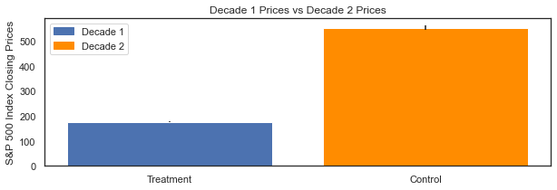
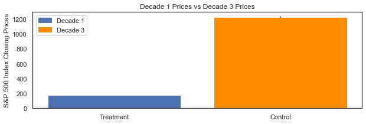
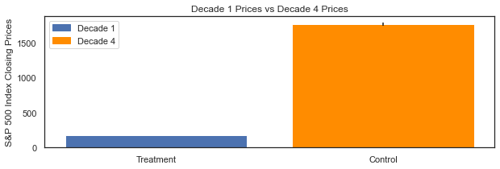
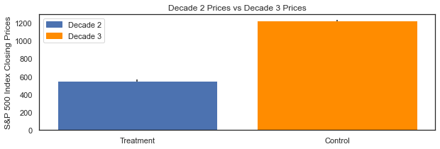
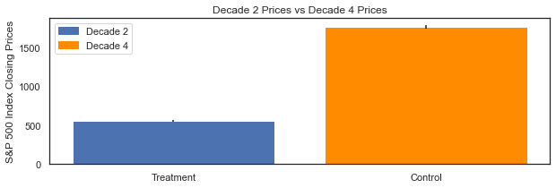
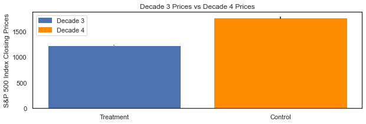

# S_P_500_Index_Analysis

## Project Description

In the analysis, the S&P 500 Index closing prices were explored within a four decade time frame. The objective was to analyze the index and determine if it was an invaluable long term investment.

Four decades:

Decade 1: 1979 - 1989 
Decade 2: 1989 - 1999 
Decade 3: 1999 - 2009 
Decade 4: 2009 - 2019 

The analysis sought to understand the compounded returns (not including dividends) the index produced in the above time frames. 

A/B were used to infer if the difference in means of prices between decades were statistically significant. The goal was to observe if the closing prices were higher or lower between the time frames and determine the investment risk.

If the prices were higher in each new decade and statistically significant, intuitively, this was determined to be a positive sign and that the index was producing profits; the opposite was true for the opposite results.

In addition to the above, the analysis observed trends in economic data regarding U.S Real GDP, S&P 500 Index EPS, Ten Year U.S Treasury Bond Yields, and Average Annual U.S Inflation over the same time period to aid in the analysis.

The analysis can be taken advantage of by any individual or entity looking for a valuable investment opportunity.

## Methods Used

1) Descriptive Statistics - used for preliminary data exploration.
2) Inferential Statistics - used to infer risk in the S&P 500 Index closing prices. 

## Results 

### A/B Tests and Monte Carlo Simulations

Time frame combinations:

**Note** - all p-values are significant at **p < 0.05**.

**Decade 1 and Decade 2:**

* With 95% confidence, the difference in mean closing prices can be found between **-$386.29 and -$366.81 (distribution: $166.9, $176.64, $186.38)**.
* If The investor bought the S&P 500 Index at the beginning of Decade 1 and sold at the end of Decade 2 (20 years), the investor would have earned an actual 20Yr compounded return of **14%**.

**Decade 1 and Decade 3:** 

* With 95% confidence, the difference in mean closing prices can be found between **-$1056.13 and -$1041.1 (distribution: $169.13, $176.64, $184.16)**.
* If The investor bought the S&P 500 Index at the beginning of Decade 1 and sold at the end of Decade 3 (30 years), the investor would have earned an actual 30Yr compounded return of **8%**.

**Decade 1 and Decade 4:**

* With 95% confidence, the difference in mean closing prices can be found between **-$1611.35 and -$1566.89 (distribution: $154.42, $176.64, $198.88)**.
* If The investor bought the S&P 500 Index at the beginning of Decade 1 and sold at the end of Decade 4 (40 years), the investor would have earned an actual 40 Yr compounded return of **8%**.

**Decade 2 and Decade 3:** 

* With 95% confidence, the difference in mean closing prices can be found between **-$683.86 and -$660.27 (distribution: $541.4, $553.19, $564.99)**.
* If The investor bought the S&P 500 Index at the beginning of Decade 2 and sold at the end of Decade 3 (20 years), the investor would have earned an actual 20Yr compounded return of **6%**.

**Decade 2 and Decade 4:**

* With 95% confidence, the difference in mean closing prices can be found between **-$1236.59 and -$1188.55 (distribution: $529.18, $553.19, $577.22)**.
* If The investor bought the S&P 500 Index at the beginning of Decade 2 and sold at the end of Decade 4 (30 years), the investor would have earned an actual 30Yr compounded return of **8%**.

**Decade 3 and Decade 4:**

* With 95% confidence, the difference in mean closing prices can be found between **-$563.71 and -$517.3 (distribution: $1202.06, $1225.26, $1248.47)**.
* If The investor bought the S&P 500 Index at the beginning of Decade 3 and sold at the end of Decade 4 (10 years), the investor would have earned an actual 20 Yr compounded return of **4%.**

The S&P 500 Index has proven to be a profitable investment with a high margin of safety for the long term investor.  
Over the 40-year time frame, the actual annual compounded return for the index was 9%. 
A $100,000 investment at the beginning of the 40-year time frame would now be worth $3,140,942 over the 40-year time frame. 

**Note** - Also, returns have been slowing down in the recent decade and can be explained, in-part, by the unprecedented low interest rate environment.

**Dashboard:**

**Note** - The dashboard is optimized for a 13-inch desktop.

https://public.tableau.com/profile/josepp8009#!/vizhome/SP500Index_16105134799210/Dashboard

## Technologies 

1) Python 
2) Jupyter Notebook
3) Anaconda Environment

## Order of Analysis

1) **Data_Preprocessing_EDA.ipynb**
2) **S&P_500_Index_Analysis.ipynb**

## Directory Files

1) **Data_Preprocessing_EDA.ipynb** - Data preprocessing and exploration.
2) **S&P_500_Index_Analysis.ipynb** - A/B testing analysis of the difference in the S&P 500 Index mean closing prices between decades.
3) **St.Louis_Fed_Bank_API.ipynb** - St.Louis Fed Bank API to gather real annual U.S GDP data.
4) **Stats_Functions.ipynb** - Stats functions.
5) **Preprocessing_Functions.ipynb** - Preprocessing Functions.

